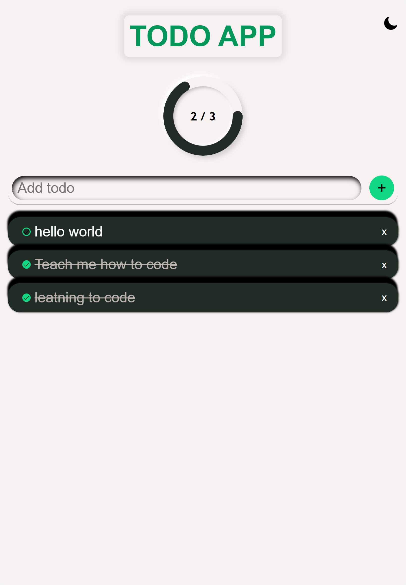

# 📝 Todo List App

A simple yet powerful Todo List application to manage your daily tasks. Built with [JavaScript, HTML and CSS] and deployed on Vercel.

🔗 **Live Demo**: [https://todo-app.vercel.app](https://todo-list-js-gamma-two.vercel.app/)



---

## ✨ Features
- ✅ **Add and delete tasks**  
- 💎 **A circular progress bar showing all/completed task**  
- 🏷️ **Mark tasks as complete/incomplete**  
- 🌙 **Dark/Light mode toggle** 
- 📱 **Fully responsive design**  

---

## 🛠️ Tech Stack
- **Frontend**: [JavaScript/HTML/CSS]
- **Styling**: [CSS]  
- **Deployment**: [Vercel]  

---

## 🚀 Quick Start

### Local Setup
 **Clone the repository**:
   ```bash
   git clone https://github.com/Obiorakingsley/Todo-list-js.git
   cd todo-list-app
